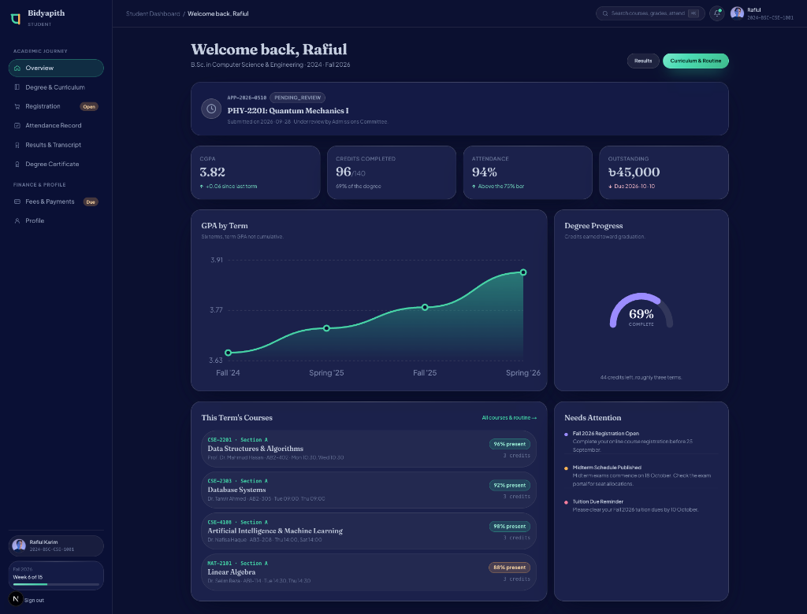
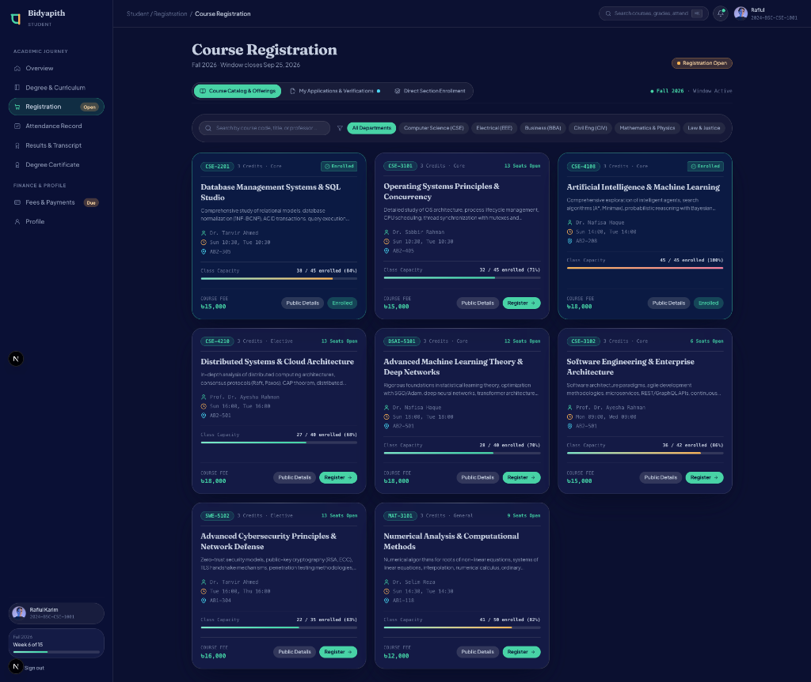
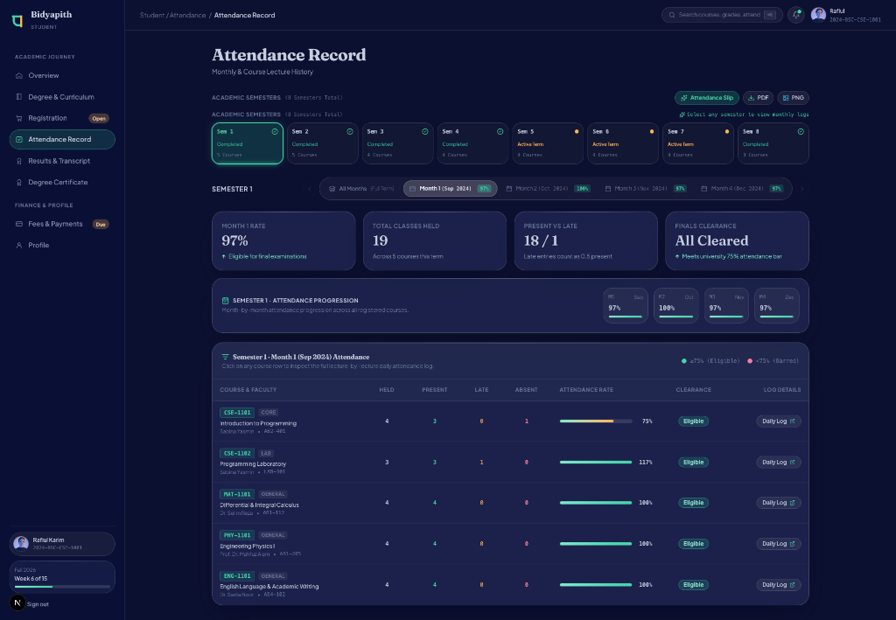
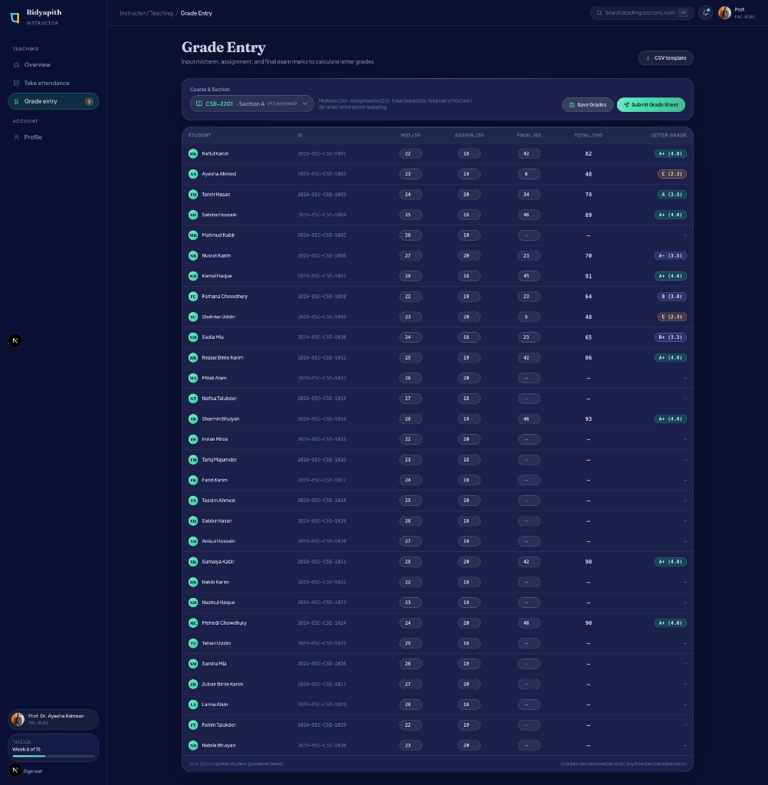
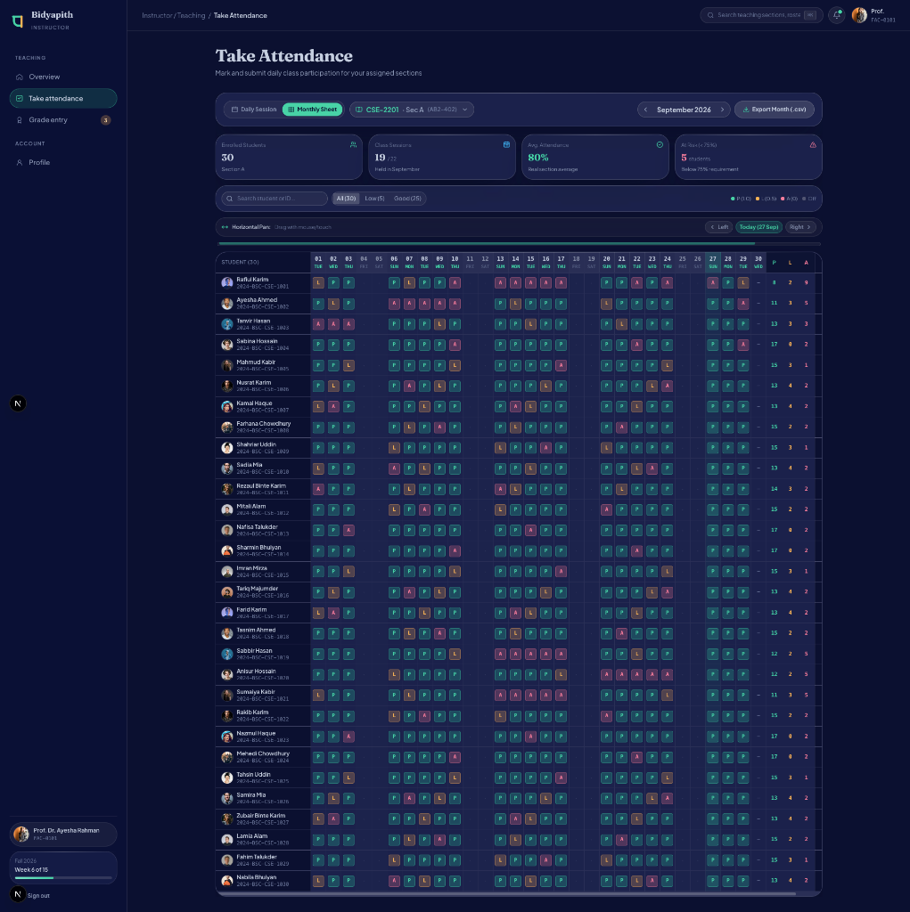
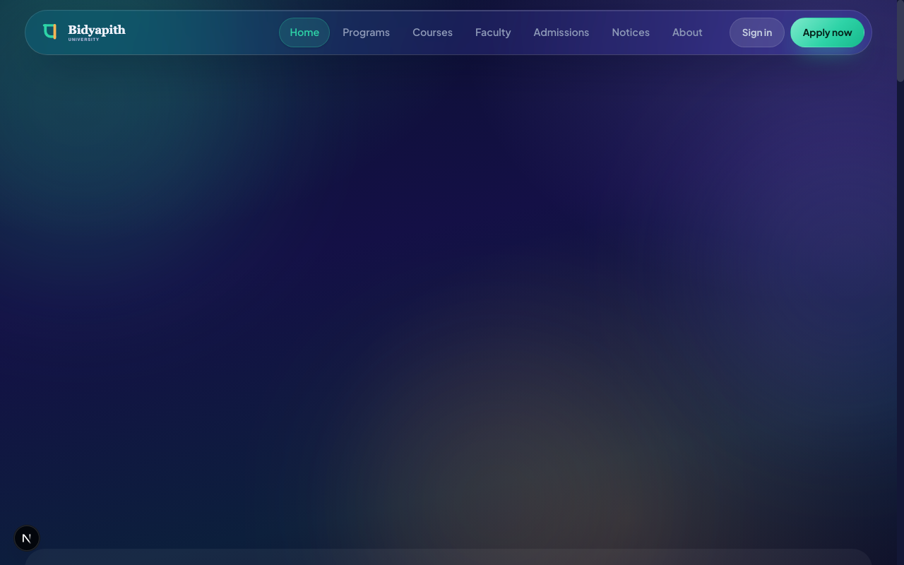

# 🎓 Bidyapith — University Management & Student Information System (Frontend)

<div align="center">

[](https://nextjs.org/)
[](https://react.dev/)
[](https://www.typescriptlang.org/)
[](https://tailwindcss.com/)
[](https://redux-toolkit.js.org/)
[](https://github.com/parvejme24/bidyapith-frontend/actions/workflows/frontend-ci.yml)
[](LICENSE)

**An enterprise-grade, responsive, and accessible University Management System (UMS) and Student Information System (SIS) frontend application.**

[Live Deployment (Primary)](https://bidyapith-frontend.vercel.app/) • [Live Deployment (Mirror)](https://momentum-frontend-pi.vercel.app/) • [Backend API](https://bidyapith-backend.onrender.com)

</div>

---

## 📖 Introduction

**Bidyapith** is an institutional web platform tailored for modern universities, colleges, and higher-education academies. It simplifies academic governance by providing unified, role-based workflows for institutional administrators, faculty educators, enrolled students, and prospective applicants.

Developed with **Next.js 16 (App Router)** and **React 19**, Bidyapith provides sub-second page transitions, dynamic theme adaptations (Dark/Light modes), keyboard-first command search (`⌘K`), and high-density data visualizations.

---

## 📝 Description

Modern educational institutions often struggle with fragmented software for admissions, class scheduling, grading, and tuition billing. Bidyapith solves this by centralizing all four primary university stakeholders into an integrated portal:

1. **Admissions & Public Visitors:** Explore degree offerings, departmental faculties, and submit multi-step admission applications online.
2. **Students:** Track degree progress, register for courses with automatic prerequisite & conflict checking, access printable transcripts, and pay tuition fees.
3. **Faculty Members:** Manage course rosters, maintain attendance records, and input semester grades with live weighted GPA computation.
4. **University Administrators:** Oversee academic departments, program curricula, semester offering quotas, and institutional revenue metrics.

---

## 🌐 Live Links & Repositories

| Resource | URL |
|---|---|
| **Frontend Production (Primary)** | [https://bidyapith-frontend.vercel.app/](https://bidyapith-frontend.vercel.app/) |
| **Frontend Production (Mirror)** | [https://momentum-frontend-pi.vercel.app/](https://momentum-frontend-pi.vercel.app/) |
| **Frontend GitHub Repository** | [https://github.com/parvejme24/bidyapith-frontend.git](https://github.com/parvejme24/bidyapith-frontend.git) |
| **Related Repository (Momentum)** | [https://github.com/parvejme24/momentum-frontend.git](https://github.com/parvejme24/momentum-frontend.git) |
| **Backend REST API** | [https://bidyapith-backend.onrender.com](https://bidyapith-backend.onrender.com) |
| **Backend GitHub Repository** | [https://github.com/parvejme24/bidyapith-backend.git](https://github.com/parvejme24/bidyapith-backend.git) |

---

## 🛠️ Tech Stack

| Category | Technology | Version | Purpose / Use Case |
|---|---|---|---|
| **Core Framework** | [Next.js (App Router)](https://nextjs.org/) | `16.3.4` | Server & Client Components, Route Handlers, SEO optimization |
| **UI Library** | [React](https://react.dev/) | `19.2.8` | Component architecture, concurrency, and modern hooks |
| **Language** | [TypeScript](https://www.typescriptlang.org/) | `5.x` | Strict type safety and schema contracts across codebase |
| **Styling & CSS** | [Tailwind CSS](https://tailwindcss.com/) | `v4.x` | High-performance CSS framework with `@tailwindcss/postcss` |
| **UI Component Primitives** | [shadcn/ui](https://ui.shadcn.com/) / [@base-ui/react](https://base-ui.com/) | `4.21.0` | Accessible WAI-ARIA compliant design system primitives |
| **State Management** | [Redux Toolkit (RTK)](https://redux-toolkit.js.org/) | `2.12.0` | Centralized global application and auth session state |
| **Server Cache & Async Queries** | [TanStack React Query](https://tanstack.com/query) | `5.102.8` | Optimistic mutations, background caching, and auto-refetch |
| **Data Grids & Tables** | [TanStack Table](https://tanstack.com/table) | `9.2.4` | Virtualized sorting, filtering, and high-density pagination |
| **Form Handling & Validation** | [React Hook Form](https://react-hook-form.com/) + [Zod](https://zod.dev/) | `7.87` / `3.25` | Schema-driven form validation and type inference |
| **Data Visualization** | [Recharts](https://recharts.org/) | `3.10.1` | Institutional analytics, enrollment charts, and revenue metrics |
| **Micro-Animations** | [Framer Motion](https://www.framer.com/motion/) | `13.2.0` | Fluid page transitions, modal dialogs, and interactive widgets |
| **Theme System** | [next-themes](https://github.com/pacocoursey/next-themes) | `0.4.6` | Dynamic Dark / Light / System theme switching with CSS variables |
| **HTTP Client** | [Axios](https://axios-http.com/) | `1.20.0` | REST communication with token refresh interceptors |
| **Icons & Design** | [Lucide React](https://lucide.dev/) | `1.41.0` | Modern, clean UI iconography |
| **Notifications & Toast** | [Sonner](https://sonner.emilkowal.ski/) | `2.0.8` | Opinionated, elegant toast notifications |

---

## 🔄 CI/CD & GitHub Actions Automation

The repository includes automated Continuous Integration (CI) and build verification via GitHub Actions:

```
Push / Pull Request ➔ Lint & Typecheck (tsc + ESLint) ➔ Next.js Production Build ➔ Automated Deployment
```

* **Workflow File:** [`.github/workflows/frontend-ci.yml`](.github/workflows/frontend-ci.yml)
* **Automated Checks:**
  1. **Node.js 20.x Setup:** Optimized with caching on `package-lock.json`.
  2. **Static Type Validation:** Strict TypeScript analysis (`npm run typecheck`).
  3. **Code Quality Linting:** Automated ESLint checks (`npm run lint`).
  4. **Next.js Production Build:** Cache-enabled build compilation (`npm run build`).
* **Continuous Deployment:** Seamless automated deployment to **Vercel** on every push to `main`.

---

## 🌟 Key Features

### 1. 👨‍💼 Institutional Administration Portal (`/admin`)
* **Live Analytics Dashboard:** Interactive Recharts visualising student enrollment trends, revenue breakdowns, and faculty-to-student ratios.
* **Academic Catalog Management:** Create and configure Departments, Programs, Courses, and multi-tier prerequisite requirements.
* **Semester & Section Offerings:** Real-time seat allocation, instructor assignments, and class timetable scheduling.
* **User Governance:** Complete lifecycle management for students, faculty, and administrative staff.

### 2. 👨‍🏫 Instructor & Faculty Portal (`/instructor`)
* **Course Workspaces:** Manage active class rosters, syllabus files, and announcements.
* **Interactive Gradebook:** High-density spreadsheet grade entry with automatic continuous assessment and final weighted GPA calculations.
* **Attendance Ledger:** Fast daily attendance logging with automated warnings for students falling below the 75% exam eligibility threshold.

### 3. 👨‍🎓 Student Portal (`/student`)
* **Academic Hub:** Real-time course schedule, attendance percentage tracking, and CGPA standing.
* **Self-Service Enrollment:** Course registration wizard preventing schedule conflicts and verifying prerequisite completions.
* **Printable Transcripts & Certificates:** Verifiable academic certificates and transcript layouts designed with print-media CSS.
* **Fee Invoicing & Payments:** View outstanding dues and securely complete checkout via Stripe.

### 4. 🌐 Public Experience & Global Utilities
* **Multi-Step Admissions:** Clean student application pipeline with drag-and-drop document uploads.
* **Global Command Palette (`⌘K` / `Ctrl+K`):** Instant search indexing across courses, faculty, and navigation portals.
* **Adaptive Theme Engine:** System, dark, and light mode persistence using `next-themes`.

---

## 📂 Project Structure

```text
bidyapith_frontend/
├── .github/
│   └── workflows/
│       └── frontend-ci.yml          # GitHub Actions CI workflow
├── app/                             # Next.js 16 App Router
│   ├── (public)/                    # Public routes (about, admissions, courses, programs, notices)
│   ├── (auth)/                      # Authentication flows (login, register, forgot/reset-password)
│   ├── admin/                       # Admin dashboard views & management tables
│   ├── instructor/                  # Faculty gradebooks, rosters, and attendance
│   ├── student/                     # Student academic hub, registration, and certificates
│   ├── globals.css                  # Tailwind CSS v4 design tokens and utilities
│   └── layout.tsx                   # Root layout with Redux, Theme, and Query providers
├── components/                      # Modular UI component library
│   ├── dashboard/                   # Role-specific topbars, sidebars, and widgets
│   ├── home/                        # Landing page hero, metric charts, and feature sections
│   ├── site/                        # Public navigation, footers, page headers, skeletons
│   └── ui/                          # Accessible shadcn / Base UI primitives
├── hooks/                           # Custom reusable React hooks
├── lib/                             # Core utilities and client services
│   ├── api-client/                  # Modular REST API clients by domain
│   ├── redux/                       # Redux Toolkit slices and RTK Query base API
│   └── utils.ts                     # Class merge (`cn`) and formatting helpers
└── public/                          # Static brand assets, icons, and illustrations
```

---

## 📸 Screenshots & UI Preview

<div align="center">

| Student Academic Cockpit (CGPA & Dues) | Course Registration & Capacity Engine |
|:---:|:---:|
|  |  |

| Student Attendance & 75% Clearance | Instructor Grade Entry & Marksheet |
|:---:|:---:|
|  |  |

| Instructor Monthly Attendance Matrix | Public Landing & Real-Time Campus Stats |
|:---:|:---:|
|  |  |

</div>

---

## 🚀 Local Installation & Setup

### Prerequisites
* **Node.js**: `v20.x` or higher
* **Package Manager**: `npm` / `pnpm` / `yarn`
* **Backend API**: Running instance of [bidyapith-backend](https://github.com/parvejme24/bidyapith-backend)

### Steps

1. **Clone the repository:**
   ```bash
   git clone https://github.com/parvejme24/bidyapith-frontend.git
   cd bidyapith_frontend
   ```

2. **Install dependencies:**
   ```bash
   npm install
   ```

3. **Configure Environment Variables:**
   Create a `.env.local` file in the root directory:
   ```env
   NEXT_PUBLIC_API_URL=http://localhost:5001/api/v1
   NEXT_PUBLIC_STRIPE_PUBLISHABLE_KEY=pk_test_...
   ```

4. **Start the development server:**
   ```bash
   npm run dev
   ```
   Open [http://localhost:3000](http://localhost:3000) in your browser.

5. **Run Linting and Type Verification:**
   ```bash
   npm run typecheck
   npm run lint
   ```

---

## 🎯 Conclusion

**Bidyapith Frontend** demonstrates an enterprise-grade web application architecture featuring strict TypeScript type safety, decoupled state management, high-performance styling, and automated CI/CD deployment pipelines. It represents a production-ready solution capable of scaling to thousands of concurrent institutional users.

---

## 📄 License

This project is licensed under the [ISC License](LICENSE).
